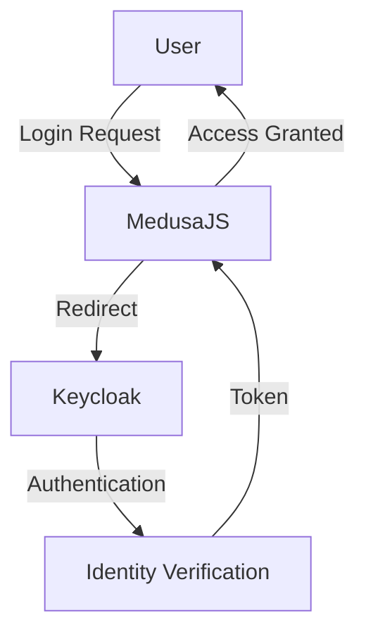

# MedusaJS Keycloak Authentication

🔐 Seamless Keycloak Identity and Access Management for MedusaJS

## 🌟 Features

- Native Keycloak authentication integration
- Multi-provider authentication support
- Secure OAuth 2.0 / OpenID Connect implementation
- Flexible configuration options
- Role-based access control
- Single Sign-On (SSO) capabilities

## 🏗️ Authentication Architecture



## 📦 Installation

Install the package using npm:
```bash
npm install @vymalo/medusa-keycloak
```

Or using yarn:
```bash
yarn add @vymalo/medusa-keycloak
```

## 🚀 Configuration Example

```typescript
modules: [
  {
    resolve: '@medusajs/medusa/auth',
    options: {
      providers: [
        // Keycloak Authentication Provider
        {
          resolve: `@vymalo/medusa-keycloak`,
          id: 'vymalo-keycloak',
          options: {
            // Keycloak Server Configuration
            url: process.env.KEYCLOAK_URL,
            realm: process.env.KEYCLOAK_REALM,
            clientId: process.env.KEYCLOAK_CLIENT_ID,
            clientSecret: process.env.KEYCLOAK_CLIENT_SECRET,
            
            // Optional Advanced Configuration
            scope: 'openid profile email', // default
            default_redirect_uri: process.env.KEYCLOAK_CALLBACK_URL,
          }
        },
        ...,
      ],
    },
  }
]
```

## 🔧 Environment Variables

Required Configuration:
- `KEYCLOAK_URL`: Keycloak server base URL
- `KEYCLOAK_REALM`: Keycloak realm name
- `KEYCLOAK_CLIENT_ID`: Application client ID
- `KEYCLOAK_CLIENT_SECRET`: Client secret

Optional Configuration:
- `KEYCLOAK_SCOPE`: Authentication scopes
- `KEYCLOAK_CALLBACK_URL`: Custom callback URL

## 🛡️ Security Considerations

- Use environment variables for sensitive credentials
- Implement proper scope restrictions
- Rotate client secrets periodically
- Configure appropriate token lifetimes

## 🌐 Advanced Integration Options

### Authentication Flow Customization
- Support multiple authentication providers
- Fallback mechanisms
- Role-based access control
- Custom claim mapping

### Token Management
- Access token validation
- Refresh token handling
- Session management
- Single sign-on (SSO) support

## 📊 Supported Authentication Flows

- Authorization Code Flow
- Implicit Flow
- Hybrid Flow
- Client Credentials Flow
- Direct Access Grants

## 🤝 Contributing

Contributions are welcome!
- Improve authentication logic
- Add new Keycloak configuration options
- Enhance security features
- Provide more robust error handling

## 🐛 Troubleshooting

- Verify Keycloak server connectivity
- Check client configuration
- Validate environment variables
- Review network and CORS settings

## 📄 License

[Check the license](./LICENSE)

## 🔗 Related Resources

- [Keycloak Documentation](https://www.keycloak.org/documentation)
- [OAuth 2.0 Specification](https://oauth.net/2/)
- [OpenID Connect](https://openid.net/connect/)
- [MedusaJS](https://medusajs.com/)