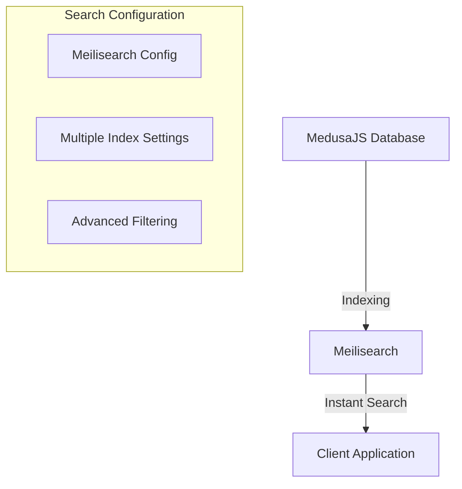

# MedusaJS Meilisearch Integration

🔍 Powerful, lightning-fast search integration for MedusaJS using Meilisearch

## 🌟 Features

- Instant, typo-tolerant search capabilities
- Highly configurable indexing
- Real-time search updates
- Advanced filtering and ranking
- Seamless MedusaJS integration

## 🏗️ Search Architecture



## 📦 Installation

Install the package using npm:

```bash
npm install @vymalo/medusa-meilisearch
```

Or using yarn:

```bash
yarn add @vymalo/medusa-meilisearch
```

## 🚀 Configuration Types

### Core Configuration Interface

```typescript
interface MeilisearchAddOnOptions {
    // Meilisearch client configuration
    config: Config;  // Meilisearch connection settings

    // Index-specific settings
    settings?: {
        [key: string]: SearchTypes.IndexSettings;
    };
}
```

### Search Options

```typescript
interface IndexSettings {
    // Provider-specific index configuration
    indexSettings: Record<string, unknown>;

    // Primary key for unique document identification
    primaryKey?: string;

    // Optional document transformer
    transformer?: (document: any) => any;
}
```

### Configuration Breakdown

- **indexSettings**: Allows provider-specific configuration
    - e.g., `searchableAttributes`, `filterableAttributes`
    - Completely flexible key-value configuration

- **primaryKey**:
    - Ensures unique documents in the index
    - Helps Meilisearch identify and manage documents
    - Recommended for data integrity

- **transformer**:
    - Modify documents before indexing
    - Allows data cleaning, restructuring
    - Useful for complex data transformations

## 🚀 Usage Example

```typescript
modules: [
    {
        resolve: '@vymalo/medusa-meilisearch',
        options: {
            // Meilisearch connection configuration
            config: {
                host: process.env.MEILISEARCH_HOST,
                apiKey: process.env.MEILISEARCH_API_KEY,
            },

            // Index-specific settings
            settings: {
                products: {
                    // Meilisearch-specific index settings
                    indexSettings: {
                        searchableAttributes: ['title', 'description'],
                        displayedAttributes: ['id', 'title', 'price'],
                        filterableAttributes: ['category', 'price']
                    },

                    // Specify primary key
                    primaryKey: 'id',

                    // Transform documents before indexing
                    transformer: (product) => ({
                        ...product,
                        // Add custom transformations
                        searchText: `${product.title} ${product.description}`,
                        // Normalize or clean data
                        price: Number(product.price).toFixed(2)
                    })
                }
            }
        },
    },
]
```

## 🛡️ Key Capabilities

- Flexible index configuration
- Dynamic search filtering
- Pagination support
- Custom ranking and relevance
- Multi-index management

## 🌐 Environment Variables

Required:

- `MEILISEARCH_HOST`: Meilisearch server URL
- `MEILISEARCH_API_KEY`: Meilisearch admin API key

## 🚀 Performance Tips

- Use appropriate index settings
- Leverage filtering and faceting
- Implement pagination
- Monitor index size and query performance
- Handle potential null/undefined values

## 🤝 Contributing

Contributions welcome!

- Improve transformation logic
- Optimize indexing performance
- Share search configuration patterns

## 📄 License

[Check the license](./LICENSE)

## 🔗 Related Resources

- [Meilisearch Documentation](https://www.meilisearch.com/docs)
- [Meilisearch Primary Key Docs](https://docs.meilisearch.com/learn/core_concepts/primary_key.html)
- [MedusaJS](https://medusajs.com/)
- [Document Transformation Strategies](https://www.meilisearch.com/docs/learn/advanced/documents)