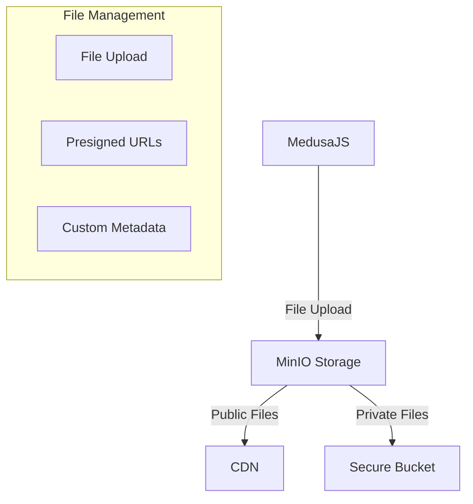

# MedusaJS Minio File Storage Provider

🗄️ Seamless MinIO file storage integration for MedusaJS - Self-hosted, S3-compatible object storage

## 🌟 Features

- Direct integration with MinIO object storage
- Support for public and private buckets
- Configurable CDN and upload options
- Flexible file key and metadata generation
- Environment variable-driven configuration

## 🏗️ Architecture Overview



### Key Capabilities
- Self-hosted object storage
- S3-compatible API
- Secure file management
- Flexible deployment options

## 📦 Installation

Install the package using npm:
```bash
npm install @vymalo/medusa-minio
```

Or using yarn:
```bash
yarn add @vymalo/medusa-minio
```

## 🚀 Configuration

### Plugin Setup

```typescript
modules: [
  {
    resolve: '@medusajs/medusa/file',
    options: {
      providers: [
        {
          resolve: '@vymalo/medusa-minio',
          id: 'minio',
          options: {
            endpoint: process.env.MINIO_ENDPOINT,
            cdn_url: process.env.MINIO_CDN_URL,
            bucket: process.env.MINIO_BUCKET,
            private_bucket: process.env.MINIO_PRIVATE_BUCKET 
              || process.env.MINIO_BUCKET,
            access_key_id: process.env.MINIO_ACCESS_KEY,
            secret_access_key: process.env.MINIO_SECRET_KEY,
          },
        },
      ],
    },
  },
]
```

## 🔧 Advanced Configuration Options

```typescript
interface MinioOptions {
  // Required Basic Configuration
  endpoint: string;        // MinIO server endpoint
  cdn_url: string;         // CDN URL for public files
  bucket: string;          // Default public bucket
  access_key_id: string;   // MinIO access key
  secret_access_key: string; // MinIO secret key

  // Optional Advanced Settings
  private_bucket?: string;  // Separate private bucket
  download_url_duration?: number; // Presigned download URL expiry
  upload_url_duration?: number;   // Presigned upload URL expiry

  // Customization Hooks
  uploadMetadata?: (file: ProviderUploadFileDTO | ProviderGetPresignedUploadUrlDTO) => ItemBucketMetadata;  // Custom metadata generator
  buildKey?: (file: ProviderUploadFileDTO | ProviderGetPresignedUploadUrlDTO) => string;  // Custom file key generator
}
```

### Customization Examples

#### Custom File Key Generation
```typescript
buildKey: (file) => {
  // Generate custom file path/key
  return `uploads/${new Date().toISOString()}/${file.originalName}`;
}
```

#### Custom Metadata
```typescript
uploadMetadata: (file) => ({
  'x-amz-meta-my-key': 'custom-value',
  'content-type': file.mimetype
})
```

## 🌐 Environment Variables

Required Environment Variables:
- `MINIO_ENDPOINT`: MinIO server URL
- `MINIO_CDN_URL`: CDN endpoint for public files
- `MINIO_BUCKET`: Default public bucket name
- `MINIO_ACCESS_KEY`: MinIO access key
- `MINIO_SECRET_KEY`: MinIO secret key

Optional Environment Variables:
- `MINIO_PRIVATE_BUCKET`: Separate private bucket name

## 🛡️ Security Considerations

- Use strong, unique access keys
- Implement bucket-level access controls
- Rotate credentials regularly
- Use HTTPS for all communications

## 🤝 Contributing

Contributions are welcome! Please submit pull requests or open issues.

## 📄 License

[Check the license](./LICENSE)

## 🔗 Related Projects

- [MinIO](https://min.io/)
- [MedusaJS](https://medusajs.com/)
- [S3 Compatible Storage](https://min.io/docs/minio/linux/reference/minio-mc/mc-compatibility.html)