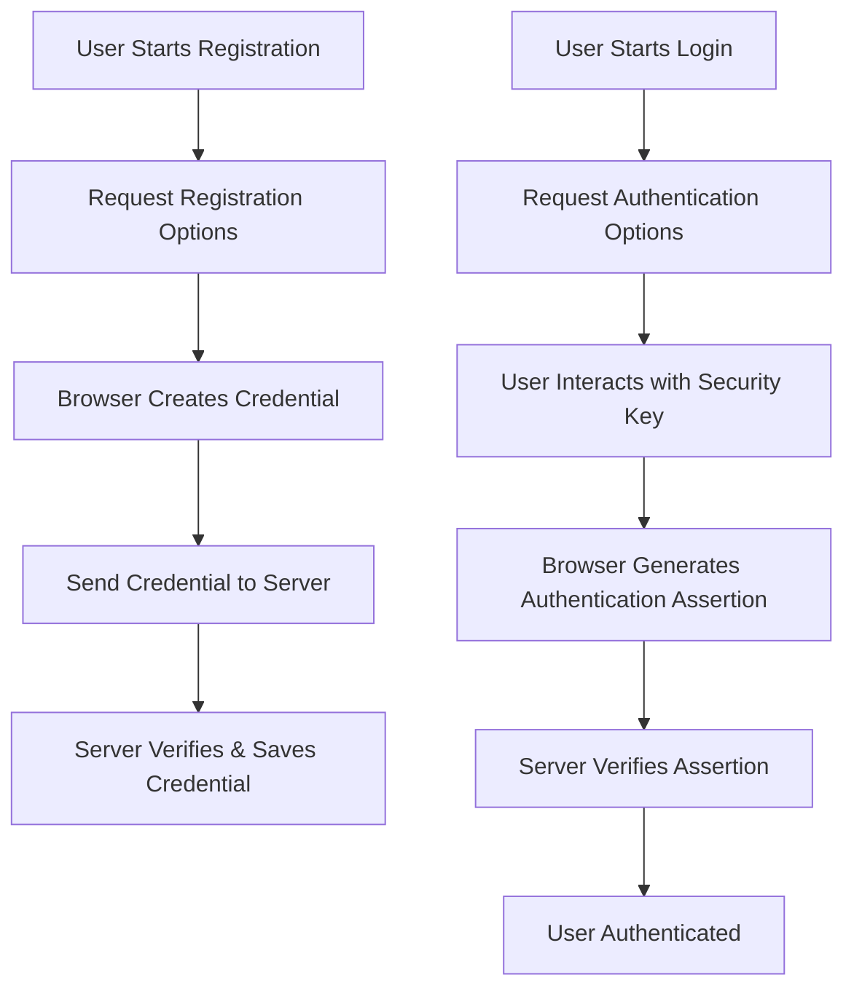
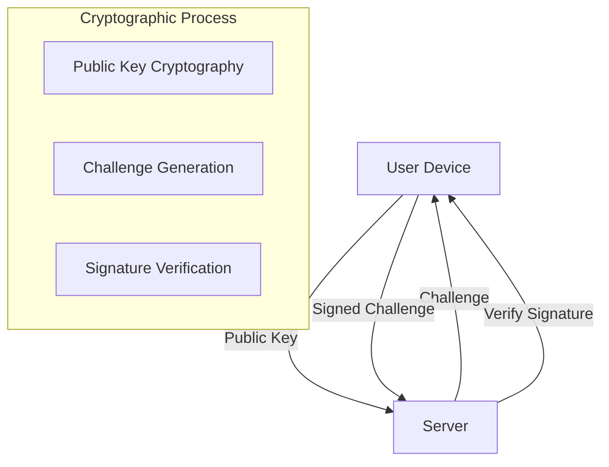

# MedusaJS WebAuthn Authentication

🔐 Passwordless Authentication for MedusaJS using WebAuthn - The Modern, Secure Authentication Standard

## 🌟 Features

- Passwordless authentication using WebAuthn
- Support for hardware and software security keys
- Enhanced security with public key cryptography
- Seamless integration with MedusaJS

## 🔒 WebAuthn Workflow



### Detailed Authentication Flow

1. **Registration**
    - User initiates registration
    - Server generates registration options
    - Browser creates a unique cryptographic credential
    - Credential verified and saved on server

2. **Authentication**
    - User starts login process
    - Server generates authentication challenge
    - User authenticates with security key
    - Server verifies the cryptographic assertion
    - User granted access

## 📦 Installation

Install the package using npm:
```bash
npm install @vymalo/medusa-webauthn
```

Or using yarn:
```bash
yarn add @vymalo/medusa-webauthn
```

## 🚀 Configuration

### Plugin Configuration

```typescript
plugins: [
  {
    resolve: "@vymalo/medusa-webauthn",
    options: {
      rpName: process.env.WEBAUTHN_RP_NAME,     // Relying Party Name
      rpID: process.env.WEBAUTHN_RP_ID,         // Relying Party ID
      origin: process.env.WEBAUTHN_ORIGIN,      // Origin of your application
    },
  },
],

projectConfig: {
  http: {
    authMethodsPerActor: {
      customer: ["webauthn"], // Enable WebAuthn for customers
    },
  },
},

modules: [
  {
    resolve: "@medusajs/medusa/auth",
    dependencies: ["webauthn_api"],
    options: {
      providers: [
        {
          resolve: "@vymalo/medusa-webauthn/auth",
          id: "webauthn",
          options: {},
        },
      ],
    },
  }
]
```

## 🛡️ Security Architecture



### Key Security Concepts

- **No Shared Secrets**: Uses public-key cryptography
- **Phishing Resistant**: Bound to specific origin and application
- **Hardware Key Support**: Works with security keys like YubiKey
- **Multi-Factor Capable**: Can combine with other authentication methods

## 🔧 Environment Variables

- `WEBAUTHN_RP_NAME`: Your application's name
- `WEBAUTHN_RP_ID`: Domain of your application
- `WEBAUTHN_ORIGIN`: Full origin URL

## 📦 Dependencies

- `@simplewebauthn/server`
- `@simplewebauthn/types`
- `superjson`

## 🤝 Contributing

Contributions are welcome! Please submit pull requests or open issues.

## 🛡️ Security Reporting

If you discover a security vulnerability, please contact [your security contact].

## 📄 License

[Check the license](./LICENSE)

## 🔗 Related Projects

- [WebAuthn Specification](https://www.w3.org/TR/webauthn-2/)
- [MedusaJS](https://medusajs.com/)
- [SimpleWebAuthn](https://simplewebauthn.dev/)